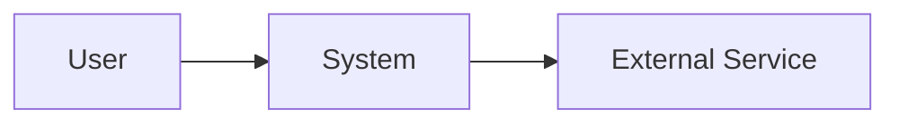

# System Design

## konteks dan tujuan

## Kondisi Saat Ini repository bukti

## Gaya Arsitektur

status eksisting/chosen gaya dan mengapa itu sesuai batasan.

## Konteks Sistem

## Containers/runtime komponen

| Komponen | tanggung jawab | Teknologi | data dimiliki | dependensi |
|---|---|---|---|---|

## Alur Utama

## Module/dependensi aturan

## data ownership dan consistency

## Komunikasi pola

dokumen ketika ke gunakan langsung calls/kontrak, event, queue, terjadwal job, atau eksternal API.

## keamanan arsitektur

## Keandalan dan kegagalan penanganan

## deployment topologi

## Observability

## Trade-off

## Pertanyaan Terbuka arsitektural pertanyaan

## ADR Terkait
