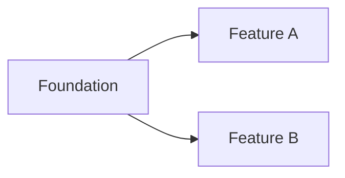

# Project Implementation Plan

## Planning assumptions

## Milestones

| Milestone | Outcome | Included features | Entry criteria | Exit criteria | Status |
|---|---|---|---|---|---|

## Dependency map

## Incremental delivery rules

- Deliver vertical slices that are demonstrable and testable.
- Every slice keeps the repository valid.
- Prefer explicit dependencies over parallel work that creates hidden coupling.
- Defer speculative abstractions until repeated evidence exists.

## Risk register

| Risk | Probability | Impact | Mitigation | Trigger | Owner |
|---|---|---|---|---|---|

## Release strategy

## Rollback strategy

## Progress reporting
