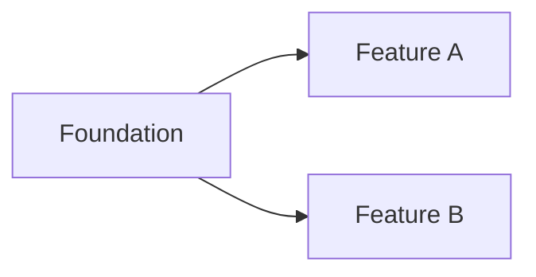

# proyek Rencana Implementasi

## perencanaan asumsi

## milestone

| milestone | hasil | disertakan fitur | masuk kriteria | keluar kriteria | status |
|---|---|---|---|---|---|

## dependensi map

## Incremental delivery aturan

- hasilkan vertical slice itu adalah dapat didemonstrasikan dan dapat diuji.
- setiap slice mempertahankan repository valid.
- utamakan eksplisit dependensi di atas paralel pekerjaan itu membuat tersembunyi coupling.
- Defer speculative abstractions until repeated bukti ada.

## Risiko daftarkan

| Risiko | Probability | Dampak | Mitigation | Pemicu | Pemilik |
|---|---|---|---|---|---|

## Strategi Rilis

## rollback strategy

## Progress reporting
