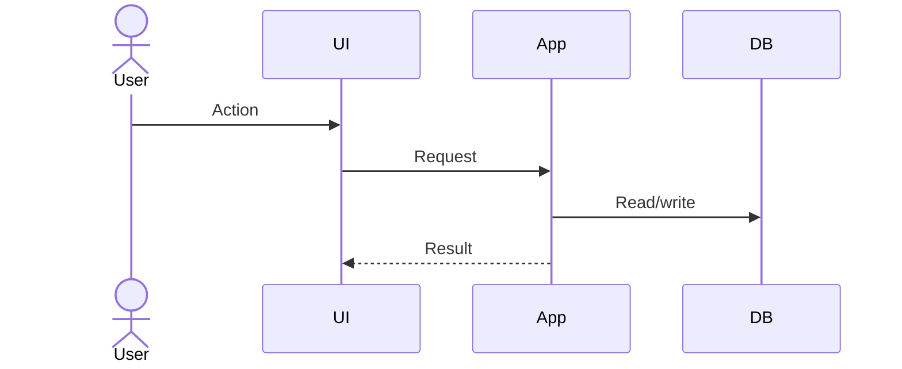

# Feature Technical Design

## Feature ID

## Existing behavior and repository evidence

## Proposed behavior

## Components/files affected

| Component/path | Change | Reason |
|---|---|---|

## Design and flow

## Domain/module boundary impact

## Data model and migration

## API/contracts/events

## Validation and error handling

## Authorization and security

## Concurrency/idempotency

## Performance

## Testing approach

## Compatibility

## Deployment and rollback

## Alternatives considered

## Required ADRs
